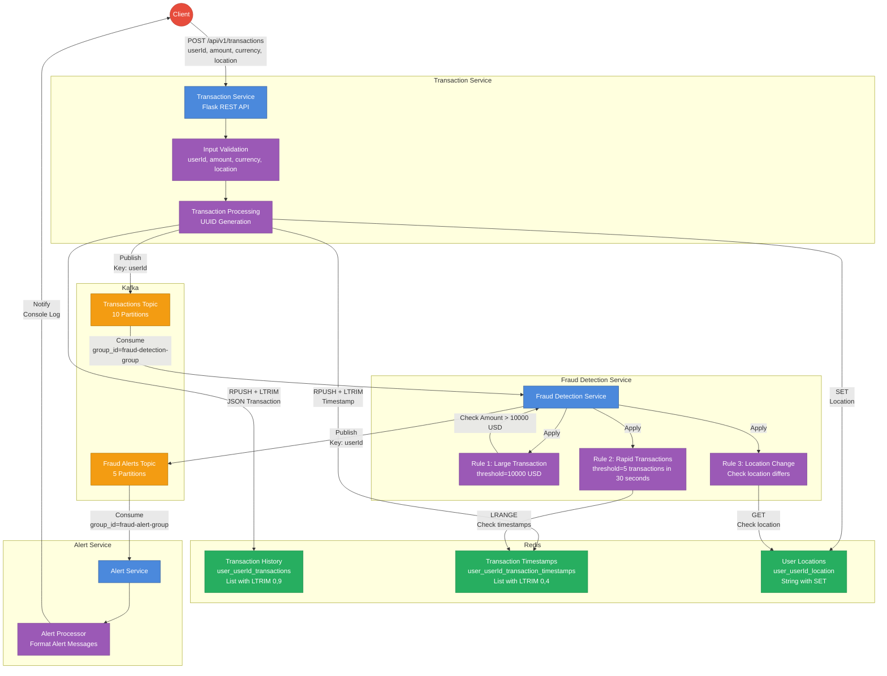
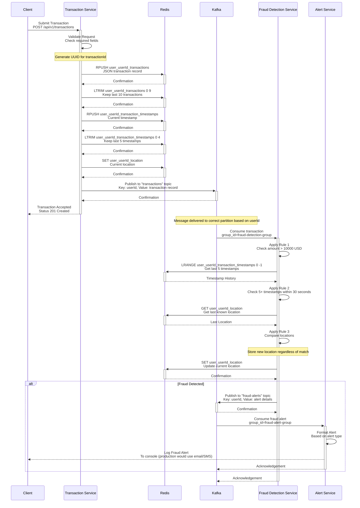
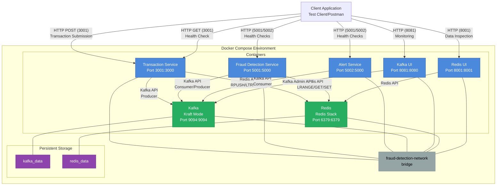

# Fraud Detection System Architecture

This document provides a visual representation of the real-time fraud detection system architecture, highlighting the transaction flow and fraud detection process with precise technical details.

## System Architecture Overview



## Transaction Flow & Fraud Detection Process

### 1. Transaction Submission
- **Client** sends a transaction request to the **Transaction Service**
  - **Endpoint**: `POST /api/v1/transactions`
  - **Request Body**:
    ```json
    {
      "userId": "user1",
      "amount": 500.00,
      "currency": "USD",
      "location": "New York"
    }
    ```
  - **Response** (Status 201):
    ```json
    {
      "status": "success",
      "transactionId": "550e8400-e29b-41d4-a716-446655440000"
    }
    ```

### 2. Transaction Processing
- **Transaction Service** validates the request (field presence and types)
- Stores transaction data in **Redis** using specific data structures:
  - **Transaction Record** (complete record):
    - **Key**: `user_userId_transactions`
    - **Type**: List
    - **Operation**: `RPUSH` followed by `LTRIM(0, 9)` to keep only last 10 transactions
    - **Format**: JSON string of transaction record
  ```json
  {
    "transactionId": "550e8400-e29b-41d4-a716-446655440000",
    "userId": "user1",
    "amount": 500.00,
    "currency": "USD",
    "location": "New York",
    "timestamp": 1648672844.765
  }
  ```
  
  - **Transaction Timestamp** (for rapid transaction detection):
    - **Key**: `user_userId_transaction_timestamps`
    - **Type**: List
    - **Operation**: `RPUSH` followed by `LTRIM(0, 4)` to keep only last 5 timestamps
    - **Format**: ISO-8601 formatted timestamps (e.g., "2023-06-15T14:22:31.000Z")
  
  - **User Location** (for location change detection):
    - **Key**: `user_userId_location`
    - **Type**: String
    - **Operation**: `SET` to update current location
    - **Format**: String in "latitude,longitude" format (e.g., "40.7128,-74.0060")

- Publishes transaction to the **Kafka** "transactions" topic:
  - **Topic**: `transactions` (10 partitions)
  - **Key**: userId (ensures all transactions for same user go to same partition)
  - **Value**: Complete transaction JSON object
  - **Serialization**: JSON

### 3. Fraud Detection
- **Fraud Detection Service** consumes transaction messages from Kafka:
  - **Bootstrap Servers**: `kafka:9092`
  - **Group ID**: `fraud-detection-group`
  - **Auto Offset Reset**: `earliest`
  - **Deserializer**: JSON

- Applies three fraud detection rules with specific thresholds:
  1. **Large Transaction Detection** (Rule 1):
     - **Threshold**: $10,000
     - **Implementation**: 
       ```python
       if transaction_record['amount'] > LARGE_TRANSACTION_THRESHOLD:
           send_fraud_alert('large_transaction_detected', transaction_record, 
                           {'threshold': LARGE_TRANSACTION_THRESHOLD})
       ```

  2. **Rapid Transactions Detection** (Rule 2):
     - **Threshold**: 5 transactions within 30 seconds
     - **Implementation**:
       ```python
       timestamps = redis_client.lrange(f'user:{user_id}:transaction_timestamps', 0, -1)
       if len(timestamps) >= RAPID_TRANSACTIONS_COUNT:
           # Convert to float and sort
           timestamps = [float(ts) for ts in timestamps]
           timestamps.sort()
           # Check time difference between oldest and newest
           time_difference = timestamps[-1] - timestamps[0]
           if time_difference < RAPID_TRANSACTIONS_TIME_WINDOW:
               send_fraud_alert('multiple_rapid_transactions_detected', transaction_record,
                               {'count': len(timestamps), 'time_window': time_difference})
       ```

  3. **Location Change Detection** (Rule 3):
     - **Implementation**:
       ```python
       last_location = redis_client.get(f'user:{user_id}:location')
       current_location = transaction_record['location']
       if last_location and last_location != current_location:
           send_fraud_alert('unusual_location_change_detected', transaction_record,
                           {'previous_location': last_location, 'current_location': current_location})
       redis_client.set(f'user:{user_id}:location', current_location)
       ```

- If fraud is detected, an alert is published to the **Kafka** "fraud-alerts" topic:
  - **Topic**: `fraud-alerts` (5 partitions)
  - **Key**: userId
  - **Value**: Alert JSON object
    ```json
    {
      "alertType": "large_transaction_detected",
      "transaction": {
        "transactionId": "550e8400-e29b-41d4-a716-446655440000",
        "userId": "user1",
        "amount": 12000.00,
        "currency": "USD",
        "location": "New York",
        "timestamp": 1648672844.765
      },
      "timestamp": 1648672845.123,
      "details": {
        "threshold": 10000
      }
    }
    ```

### 4. Alert Processing
- **Alert Service** consumes fraud alert messages from Kafka:
  - **Bootstrap Servers**: `kafka:9092`
  - **Group ID**: `fraud-alert-group`
  - **Auto Offset Reset**: `earliest`
  - **Deserializer**: JSON

- Alert format varies by alert type:
  - **Large Transaction**:
    ```
    FRAUD ALERT: large_transaction_detected
    User ID: user1
    Transaction ID: 550e8400-e29b-41d4-a716-446655440000
    Amount: 12000.00 USD
    Location: New York
    Timestamp: 2022-03-30 15:27:24
    Threshold exceeded: 10000 USD
    ```

  - **Multiple Rapid Transactions**:
    ```
    FRAUD ALERT: multiple_rapid_transactions_detected
    User ID: user2
    Transaction ID: 550e8400-e29b-41d4-a716-446655440001
    Amount: 500.00 USD
    Location: London
    Timestamp: 2022-03-30 15:28:44
    Multiple transactions detected: 5 transactions in 15.75 seconds
    ```

  - **Unusual Location Change**:
    ```
    FRAUD ALERT: unusual_location_change_detected
    User ID: user3
    Transaction ID: 550e8400-e29b-41d4-a716-446655440002
    Amount: 300.00 USD
    Location: New York
    Timestamp: 2022-03-30 15:29:24
    Location change detected: Tokyo -> New York
    ```

## Data Flow Diagram



## Physical Deployment Architecture



## Key System Components

| Component | Technology | Purpose | Port | Configuration |
|-----------|------------|---------|------|---------------|
| Transaction Service | Python 3.9 / Flask 2.0.1 | Receives transactions, stores data, publishes to Kafka | 3001:3000 | Werkzeug 2.0.3, Connection retries |
| Fraud Detection Service | Python 3.9 | Consumes transactions, applies fraud rules | 5001:5000 | Auto offset reset: earliest, Detection thresholds configurable |
| Alert Service | Python 3.9 | Consumes fraud alerts, formats notifications | 5002:5000 | Group ID: fraud-alert-group |
| Kafka | Apache Kafka (Bitnami) | Message broker for transaction and alert streams | 9094:9094 | Kraft mode, 10/5 partitions for topics |
| Kafka UI | provectuslabs/kafka-ui | Web interface for monitoring Kafka | 8081:8080 | Connects to Kafka on bootstrap port |
| Redis | Redis Stack | In-memory data store for transaction history | 6379:6379 | Password protected, Persistence enabled |
| Redis UI | Redis Stack | Web interface for monitoring Redis data | 8001:8001 | Integrated with Redis Stack |

## Error Handling & Resilience

1. **Connection Retries**:
   - All services implement retry logic for Kafka and Redis connections
   - Default: 5 retries with 5-second backoff

2. **Health Check Endpoints**:
   - Transaction Service: `GET /api/v1/health` - Checks Kafka and Redis connectivity
   - Fraud Detection Service: `GET /health` - Validates Kafka consumer/producer and Redis
   - Alert Service: `GET /health` - Verifies Kafka consumer connection

3. **Data Validation**:
   - Transaction Service validates all input fields before processing
   - Error responses include specific validation failure details

4. **Persistence Strategy**:
   - Redis data persists across container restarts via volume mounting
   - Kafka uses Kraft mode for metadata resilience

5. **Consumer Group Management**:
   - Distinct consumer groups prevent message duplication
   - Auto offset reset ensures no messages are missed during restarts 

#### Redis Operations

```python
# Store a transaction in the user's history
redis_client.rpush(f"user_userId_transactions", json.dumps({
    "transactionId": "1234-5678-9012",
    "userId": "user123",
    "amount": 5000.00,
    "currency": "USD",
    "timestamp": "2023-06-15T14:22:31.000Z",
    "location": "40.7128,-74.0060"
}))

# Trim to keep only the last 10 transactions
redis_client.ltrim(f"user_userId_transactions", 0, 9)

# Store transaction timestamp for velocity checks
redis_client.rpush(f"user_userId_transaction_timestamps", "2023-06-15T14:22:31.000Z")
redis_client.ltrim(f"user_userId_transaction_timestamps", 0, 4)

# Store and retrieve user location
redis_client.set(f"user_userId_location", "40.7128,-74.0060")
last_location = redis_client.get(f"user_userId_location") 