# Real-Time Fraud Detection System

A real-time fraud detection system built with Python, Kafka, and Redis. This system processes financial transactions, detects potential fraudulent activities, and generates alerts.

# Simplified Fraud Detection System Architecture

```mermaid
graph LR
    %% Styling
    classDef client fill:white,stroke:black,color:black
    classDef transaction fill:#d4f8d4,stroke:#7fbf7f,color:black
    classDef kafka fill:#e6f3ff,stroke:#99ccff,color:black
    classDef redis fill:#d9ecff,stroke:#66b3ff,color:black
    classDef fraud fill:#ffd9d9,stroke:#ff9999,color:black
    classDef alert fill:#ffe6e6,stroke:#ffb3b3,color:black
    classDef kafkaTopics fill:#d9f2d9,stroke:#80cc80,color:black
    classDef normal stroke-dasharray: 5 5

    %% Nodes
    client((client)):::client
    transaction-service[transaction-<br>service]:::transaction
    
    subgraph Kafka [Kafka]
        transactions[transactions]:::kafkaTopics
        fraud-alerts[fraud-alerts]:::kafkaTopics
    end
    
    Redis[Redis]:::redis
    
    fraud-detection-service[fraud-<br>detection-<br>service]:::fraud
    alert-service[alert-service]:::alert
    
    %% Connections - regular transaction flow
    client --> transaction-service
    transaction-service --> Redis
    transaction-service --> transactions
    transactions --> fraud-detection-service
    fraud-detection-service --> Redis
    
    %% Fraud path
    fraud-detection-service -->|"IF FRAUD"| fraud-alerts
    fraud-alerts --> alert-service
    alert-service -->|"fraud alert"| client
    
    %% Non-fraud path (dashed line)
    fraud-detection-service -->|"IF VALID"| Kafka_ack[("✓")]:::normal
    
    %% Styling
    Kafka:::kafka
```



This simplified diagram shows:

1. The client submits transactions to the transaction service
2. The transaction service stores data in Redis and publishes to the Kafka transactions topic
3. The fraud detection service consumes from the transactions topic, checks Redis for historical data
4. **For fraudulent transactions:**
   - The fraud detection service publishes to the fraud-alerts topic
   - The alert service consumes from the fraud-alerts topic and sends alerts to the client
5. **For valid (non-fraudulent) transactions:**
   - The fraud detection service simply acknowledges the message to Kafka
   - No alerts are generated (the transaction is considered legitimate) 

## System Architecture

The system consists of three main services:

1. **Transaction Service**: Receives transaction requests, stores transaction data in Redis, and publishes transactions to Kafka.
2. **Fraud Detection Service**: Consumes transactions from Kafka, applies fraud detection rules, and publishes fraud alerts to Kafka.
3. **Alert Service**: Consumes fraud alerts from Kafka and processes them (in a real-world scenario, this would send emails, SMS, etc.).

## Fraud Detection Rules

The system implements the following fraud detection rules:

1. **Large Transaction Amount**: Flags transactions exceeding a predefined threshold ($10,000).
2. **Multiple Rapid Transactions**: Detects multiple transactions from the same account within a short time frame (more than five transactions within 30 seconds).
3. **Location Changes**: Identifies transactions originating from significantly different locations within a short period.

## Prerequisites

- Docker and Docker Compose
- Python 3.9+ (for running the test client)

## Getting Started

### 1. Clone the Repository

```bash
git clone <repository-url>
cd <repository-directory>
```

### 2. Start the Services

```bash
docker-compose up -d
```

This will start the following services:
- Kafka (with Kraft mode)
- Kafka UI (accessible at http://localhost:8081)
- Redis (with Redis Stack, UI accessible at http://localhost:8001)
- Transaction Service (accessible at http://localhost:3001)
- Fraud Detection Service (with health check at http://localhost:5001/health)
- Alert Service (with health check at http://localhost:5002/health)

### 3. Create Kafka Topics

The services should automatically create the required Kafka topics due to the `auto.create.topics.enable` configuration. However, if needed, you can run the provided script to create them manually:

```bash
chmod +x create-topics.sh
./create-topics.sh
```

This will create:
- `transactions` (10 partitions)
- `fraud-alerts` (5 partitions)

### 4. Check Service Health

You can check the health of all services using the test client:

```bash
python test-client.py --health
```

This will check if all services are up and running correctly.

### 5. Run the Test Client

```bash
pip install -r requirements.txt  # Install dependencies for the test client
python test-client.py
```

The test client provides several options:
- `--test large`: Test large transaction detection
- `--test rapid`: Test rapid transactions detection
- `--test location`: Test unusual location change detection
- `--test random`: Send random transactions
- `--test all`: Run all tests (default)
- `--count <number>`: Number of random transactions to send (default: 10)
- `--delay <seconds>`: Delay between random transactions in seconds (default: 1.0)
- `--health`: Check health of all services before running tests

Examples:
```bash
python test-client.py --test large
python test-client.py --test rapid
python test-client.py --test location
python test-client.py --test random --count 20 --delay 0.5
```

## Monitoring

### Kafka UI

Access the Kafka UI at http://localhost:8081 to monitor:
- Kafka topics and partitions
- Message production and consumption
- Consumer groups

### Redis UI

Access the Redis UI at http://localhost:8001 to monitor:
- Redis data structures
- Transaction records
- Transaction timestamps
- User locations

## Service Endpoints

### Transaction Service

- `POST /api/v1/transactions`: Submit a new transaction
  - Request body: `{ "userId": "user1", "amount": 100, "currency": "USD", "location": "New York" }`
  - Response: `{ "status": "success", "transactionId": "..." }`

- `GET /api/v1/health`: Check the health of the Transaction Service
  - Response: `{ "status": "healthy", "redis": "connected", "kafka": "connected" }`

### Fraud Detection Service

- `GET /health`: Check the health of the Fraud Detection Service
  - Response: `{ "status": "healthy", "consumer": true, "producer": true, "redis": true }`

### Alert Service

- `GET /health`: Check the health of the Alert Service
  - Response: `{ "status": "healthy", "consumer": true }`

## Troubleshooting

### Services Not Starting

If any of the services fail to start, check the logs:

```bash
docker-compose logs kafka
docker-compose logs transaction-service
docker-compose logs fraud-detection-service
docker-compose logs alert-service
```

### Redis Connection Issues

If there are issues connecting to Redis, make sure the password is correctly set in the environment variables:

```
REDIS_PASSWORD=scan_remember
```

### Kafka Connection Issues

If there are issues connecting to Kafka, check the Kafka broker configuration and make sure the services are using the correct bootstrap servers:

```
KAFKA_HOST=kafka:9092
```

## License

This project is licensed under the MIT License - see the LICENSE file for details. 